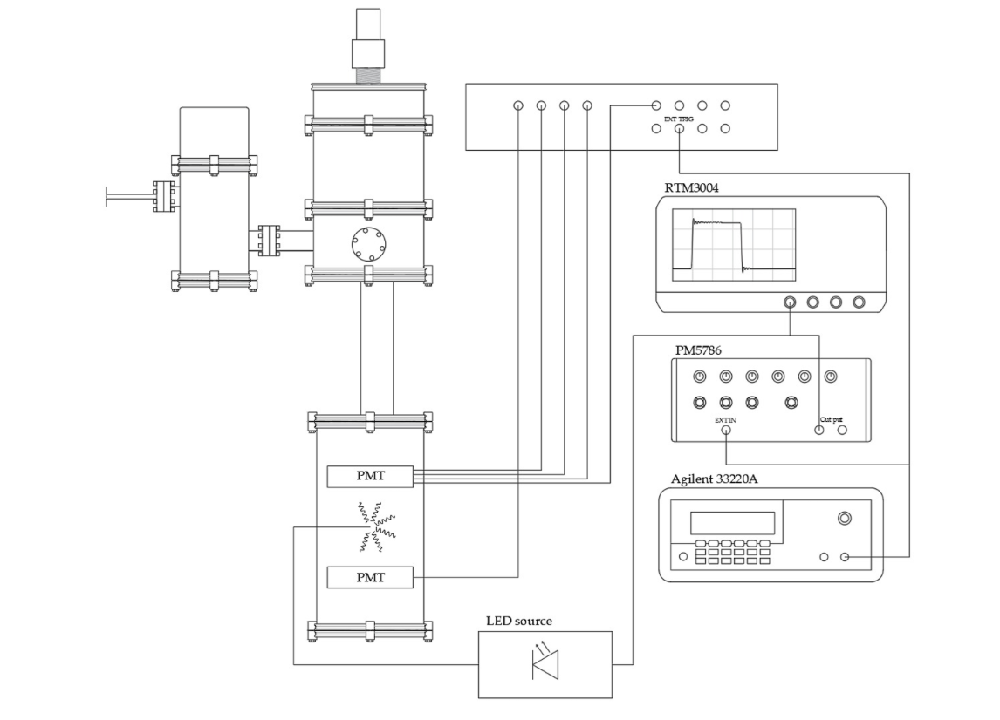

> **NOTE** — Source basis: XAMS wiki procedure “Gain Calibration for PMTs”, last
> modified 20 April 2026. This SOP preserves the settings and sequence stated in that
> source.

## A. Hardware setup

### 1. Connect the calibration hardware

> **ACTION** — **Connect the hardware according to the approved PMT LED-calibration
> setup shown** **below.**

> **VERIFY** — The function generator, pulse generator, oscilloscope, digitiser crate,
> LED source and PMT signal path are connected as in the source setup.

{width=85%}

## B. Configure the LED calibration pulse

### 2. Power the calibration equipment

> **ACTION** — **Turn on the function generator, pulse generator, oscilloscope and
> digitiser crate.**

> **VERIFY** — All four devices are powered and responsive.

### 3. Set trigger and repetition rate

> **ACTION** — **Set the function generator to generate pulses at 1 kHz. Set the pulse
> generator to** **external trigger.**

> **VERIFY** — The pulse generator is externally triggered at 1 kHz.

### 4. Configure oscilloscope measurements

> **ACTION** — **On the oscilloscope, enable Vpp and positive pulse-width measurements
> for the** **square pulse. In the measurement menu select Peak Peak for the correct
> channel, then** **select Pulse width + from the horizontal measurements for the same
> channel.**

> **VERIFY** — Vpp and pulse width are both displayed for the square pulse.

### 5. Set pulse width and amplitude

> **ACTION** — **Adjust the pulse-generator width until the oscilloscope measures
> approximately 80 ns.** **Then adjust the amplitude to the desired Vpp. Source starting
> points in LXe: bottom** **PMT \~3.25 V; top PMT \~3.45 V.**

> **VERIFY** — Pulse width is approximately 80 ns and the selected Vpp is documented for
> the run.

> **NOTE** — If these Vpp values do not produce a useful occupancy distribution, tune
> Vpp as described in Section D rather than treating the quoted values as mandatory.

## C. PMT voltage and data acquisition

### 6. Set PMT voltages

> **ACTION** — **Set the PMT voltages stated in the source procedure: bottom PMT = 1080
> V; top PMT =** **1000 V.**

> **VERIFY** — Both PMT voltage readbacks match the requested values before taking data.

### 7. Start Redax and select calibration configuration

> **ACTION** — **Start Redax and select configuration V1730_ledcalibration.**

> **VERIFY** — Redax is ready to acquire using the V1730 LED-calibration configuration.

### 8. Take the calibration run

> **ACTION** — **Take a calibration run. Use at least 120 s for a good fit; use up to
> 600 s when a more** **precise fit is required.**

> **VERIFY** — Run metadata, PMT voltages, Vpp, pulse width and run duration are
> recorded.

## D. Tune Vpp if required

### 9. Adjust LED occupancy

> **ACTION** — **The LED light output increases with pulse height. Tune Vpp so the PMT
> sees 0** **photoelectrons most often, 1 PE with nearly comparable frequency, and
> progressively** **fewer 2 PE and higher-PE events.**

> **VERIFY** — The digitised pulse-area histogram contains a useful pedestal and
> single-photoelectron population for gain fitting.

## E. Convert fitted gain from ADC to electrons

### 10. Use the CAEN V1730 conversion

| Item | Value |
| --- | --- |
| Digitiser | CAEN V1730 |
| Resolution | 14 bit = 16384 ADC counts |
| Input range | 0 to 2 V |
| Input resistance | 50 ohm |
| Sampling period | 4 ns |

| Item | Value |
| --- | --- |
| **Voltage per ADC count** **1** | 2 V / 16384 = 0.00012207 V = 0.12 mV | 
| **Voltage represented by fitted area G^ADC^2** | V = G~ADC~ x (2 V / 16384) |
| **Current through 50 ohm input** **3** | I = V / 50 ohm |
| **Charge per sample** **4** | Q = I x 4 ns |
| **Convert charge to electrons** **5** | N~e~ = Q / (1.602 x 10^-19^ C) |

## FINAL CONVERSION

> [!NOTE]
> **N**~e~ ≈ **G**~ADC~ **x 60958.96**

> **VERIFY** — Use the same definition of integrated ADC area as the calibration fit
> when applying the conversion factor.

## F. Completion

> [!IMPORTANT]
> ** FINAL CHECK ** Calibration run saved; PMT voltages, Vpp, pulse width and run ID documented; gain fit completed or queued; any Vpp tuning or deviations recorded. 
