## CALL BEFORE YOU ACT

> [!NOTE]
> **Auke-Pieter Colijn:** 06 468 121 33 **Patrick Decowski:** 06 233 989 55 **Security
> desk:** 020 592 6060

## Scope and competence

|  |  |
| --- | --- |
| **Purpose** | Bring the detector to a safe state at night, after an alarm, until an experienced operator can take over. |
| **Not for** | Planned recovery, which is SOP-006. Nothing here replaces calling the contacts first. |
| **Competence** | Trained XAMS operator on the emergency call list, briefed on cryogenics and oxygen-deficiency hazards. |
| **Before you start** | Contact made with Auke-Pieter or Patrick; security desk informed; site access available. |

> [!NOTE]
> **General hazards apply:** asphyxiation (xenon and nitrogen), cryogenic burn,
> stored energy in the gas system. Read SOP-000 before starting - and note that in
> an emergency the hazards below are more likely, not less.

## Hazards specific to this procedure

> [!DANGER]
> **Asphyxiation - the condition that triggered the alarm may already have released
> xenon or nitrogen into the laboratory.**
> Both gases displace air and cause loss of consciousness without any warning
> sensation, and at night there may be nobody to find you.
> Check the oxygen-deficiency readings from outside the room before entering, never
> enter alone, and notify the security desk on 020 592 6060 that you are in the
> laboratory and when you leave.

> [!DANGER]
> **Working alone at night, under time pressure, on a system that is already
> abnormal.**
> Haste and fatigue lead to valve errors that can make the situation worse or injure
> the operator.
> Call Auke-Pieter or Patrick before acting and stay in contact throughout; if the
> situation is not understood, secure what is safe and wait rather than improvise.

> [!WARNING]
> **Cryogenic burn - emergency LN2 lines handled in a hurry, without the usual
> preparation.**
> Contact with liquid nitrogen or an uninsulated cold surface destroys tissue within
> seconds, and haste is exactly when the gloves get skipped.
> Put on cryogenic gloves and a face shield before touching anything cold, however
> urgent the situation appears.

## A. Decide whether to go to the lab

### 1. Respond to the SMS

> **ACTION** — **Call Auke-Pieter or Patrick immediately. Together decide whether
> attendance at** **Nikhef is necessary.**

> **VERIFY** — Do not travel to the lab without first making contact, unless instructed
> otherwise by the agreed emergency chain.

### 2. Reach the laboratory

> **ACTION** — **Use your key at the gates. If the gates do not open, use the emergency
> entrance** **and call the security desk or ring the bell.**

> **STOP** — **Do not improvise access routes.**

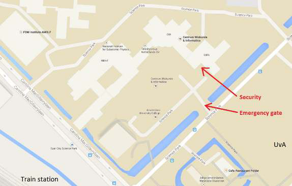{width=53%}

## B. Check whether entry is safe

### 3. Check the door alarm before entry

> **ACTION** — **Confirm there is no audible alarm. Check the indicator light above the
> door on** **the right.**

> **VERIFY** — GREEN: no gas warning. RED without audible alarm: follow the source
> instruction and only enter with two people to assess the situation. No light: use the
> flashlight on the gas panel.

> **STOP** — **LOUD AUDIBLE ALARM: DO NOT ENTER. Call the security desk and an
> emergency** **contact.**

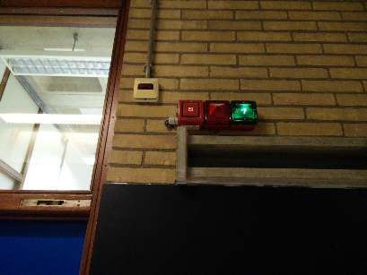{width=38%}

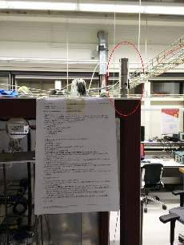{width=21%}

### 4. Never enter alone

> **ACTION** — **Wait until two people are present before entering laboratory H037.**

> **VERIFY** — Confirm both people understand the emergency task and escape route.

> **STOP** — **Do not enter alone.**

## C. Assess the detector condition

### 5. Restore essential power if needed

> **ACTION** — **Check whether power is available. If not, press the green button on the
> power** **panel.**

> **VERIFY** — Confirm essential monitoring is powered.

> **STOP** — **If power cannot be restored, call an experienced operator before
> proceeding.**

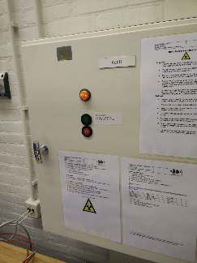{width=23%}

### 6. Check cooling and detector pressure

> **ACTION** — **Listen for the loud rhythmic PTR pumping sound. Check detector pressure
> on** **the rack. Open V22 if needed to obtain a manual-gauge reading.**

> **VERIFY** — Classify the condition: normal; emergency cooling active; or pressure
> near burst range (3.7-4.3 bar).

> **STOP** — **If pressure is close to burst and rising, vent xenon by opening V22 and
> V24. If cooling** **is off, or pressure is above normal and increasing, begin
> recuperation.**

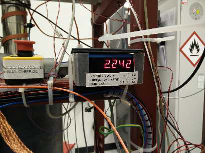{width=38%}

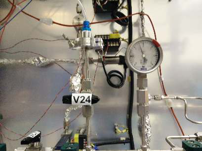{width=38%}

## D. Prepare for emergency recuperation

### 7. Open the laboratory door fully

> **ACTION** — **Release/remove the door-closing mechanism so the door remains open
> during** **the operation.**

> **VERIFY** — The escape route must remain unobstructed.

> **STOP** — **Do not begin recuperation with the door able to close behind you.**

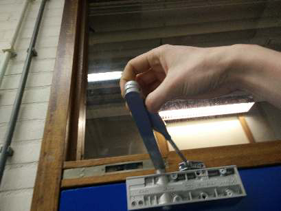{width=38%}

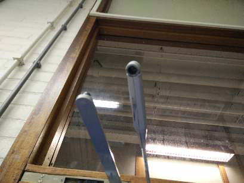{width=38%}

### 8. Reduce electrical and flow-system load

> **ACTION** — **If there is a power failure, switch off the Slow Control PC to conserve
> UPS power.** **Switch off the getter and the recirculation pump.**

> **VERIFY** — Getter switch is at the bottom; recirculation-pump rocker switch is on
> the gas board.

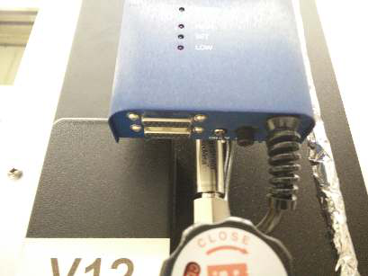{width=38%}

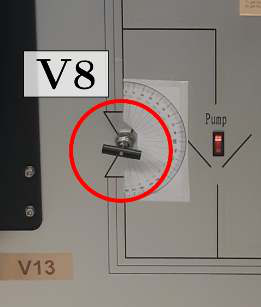{width=24%}

### 9. Close all valves before configuring recuperation

> **ACTION** — **Close the blue valves on storage cylinders A and B. Close gas-board
> valves V1** **through V13. Close pressure regulator V17 by turning it
> counter-clockwise.**

> **VERIFY** — If the electronic pressure display fails, V22 may be opened or left open
> to read the manual gauge.

> **STOP** — **Confirm the complete closed state before continuing.**

| Valve state | Required state |
| --- | --- |
| Storage cylinders A and B | Blue main valves CLOSED |
| V1-V13 | CLOSED |
| V17 regulator | CLOSED - turn counter-clockwise Open only if required for manual pressure |

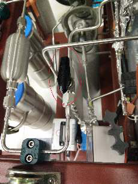{width=20%}

## E. Cool storage cylinder B with liquid nitrogen

### 10. Put on cryogenic PPE

> **ACTION** — **Remove both lids from the dewars beneath the xenon cylinders. Put on
> goggles** **and cryogenic gloves.**

> **VERIFY** — PPE must be on before handling liquid nitrogen.

> **STOP** — **Do not handle liquid nitrogen without suitable goggles and gloves.**

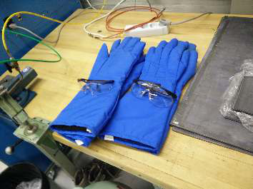{width=33%}

### 11. Fill and raise the left dewar

> **ACTION** — **Fill the left dewar to about 10 cm below the rim. Fill slowly because
> the liquid** **level is difficult to see. Raise the dewar with the crank so storage
> cylinder B is** **immersed.**

> **VERIFY** — Keep the liquid-nitrogen level below the dewar rim. As the level falls,
> raise the dewar so the liquid remains a few centimetres below the rim. Wait until
> vigorous boiling has stopped and the cylinder bottom is cold.

> **STOP** — **Do not overfill or raise the dewar so far that liquid nitrogen reaches
> the top.**

## F. Start recuperation into bottle B

### 12. Reset flow integration if Slow Control is available

> **ACTION** — **In Slow Control open Monitor and press Reset flow.**

> **VERIFY** — Confirm the flow display is active before opening the recuperation path.

### 13. Open storage cylinder B

> **ACTION** — **Open the main valve on storage cylinder B.**

> **VERIFY** — Confirm the correct bottle - B - is being used.

> **STOP** — **Do not open bottle A.**

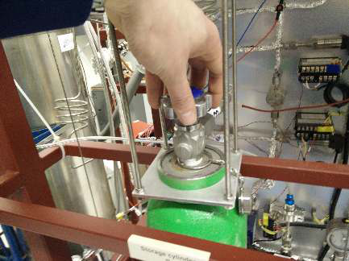{width=40%}

### 14. Verify bottle-B line pressure

> **ACTION** — **Confirm V17 is closed. Briefly open V6 and verify the high-pressure
> indication is** **below 3.7 bar. Close V6 again.**

> **VERIFY** — High pressure must be below 3.7 bar before the recuperation path is
> opened.

> **STOP** — **If pressure is 3.7 bar or higher, close V6 and call an experienced
> operator.**

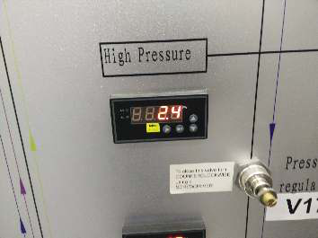{width=33%}

### 15. Open the recuperation path in the exact order

> **ACTION** — **First confirm the purification branch is isolated: V9, V11 and V13 are
> CLOSED. Then** **open V4, then V8, and finally V10.**

> **VERIFY** — Recuperation should begin only after the purification branch is isolated
> and the complete recovery path is configured.

> **STOP** — **Do not change the order or open additional valves.**

### 16. Control flow with V7

> **ACTION** — **Open and tune V7 gradually. Monitor detector pressure and Slow
> Control** **temperatures T15-T20 continuously.**

> **VERIFY** — Keep detector pressure above 0.9 bar and below 3.7 bar. If pressure drops
> too quickly, temperatures will decrease because of adiabatic expansion.

> **STOP** — **Never leave V7 unattended. If pressure or temperature changes
> unexpectedly, close** **V7 and stop.**

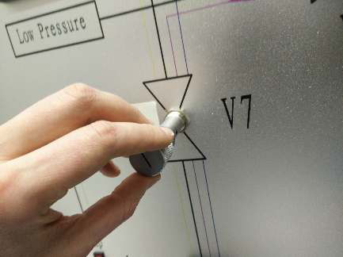{width=39%}

## G. Stabilise and hand over

### 17. Stop emergency cooling when no longer required

> **ACTION** — **Close the emergency liquid-nitrogen supply at the large dewar once
> emergency** **cooling is no longer needed.**

> **VERIFY** — Confirm detector pressure is below the critical region and stable.

## FINAL SAFE-STATE CHECK

> [!CHECKLIST]
> - Detector pressure below the critical region and stable
> - Recuperation path understood and supervised
> - V7 adjusted or closed as required
> - Emergency LN2 supply closed when no longer needed
> - Experienced operator informed
> - Continue with SOP-006 - Xenon Recovery Procedure when conditions are stable.

## Document control

| Revision | Issued | Change |
| --- | --- | --- |
| Rev. B | 2026-08-10 | First issue. |
